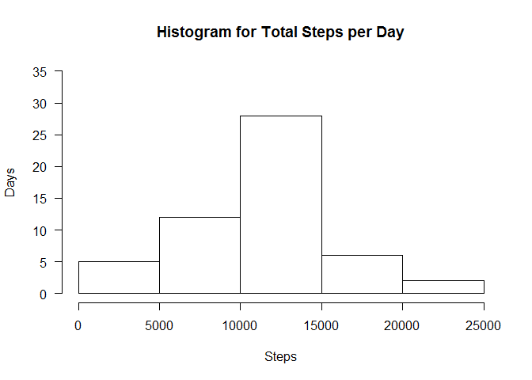
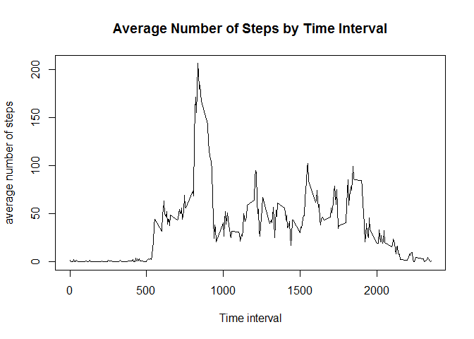
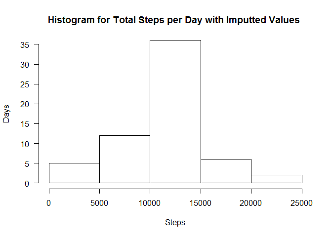
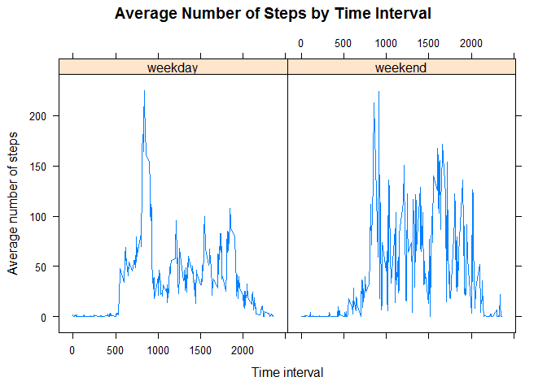

This is the assignment which processes and analyzes personal monitoring
activity data.

In order for this to run smoothly, you need to install packages DoBy and
broman!

    library("doBy")
    library(broman)
    library(lattice)

1.  Retrieving the data and checking if variables are in proper format.

<!-- -->

    #you may change the path as necessary

    dir<- "D:/cursuri/reproducible research/assignment 1/"    
    path<- paste(dir, "","activity.csv" , sep = "", collapse = NULL) 

    activity <- read.csv(path)

    #check the data and formats for variables
    str(activity)

    ## 'data.frame':    17568 obs. of  3 variables:
    ##  $ steps   : int  NA NA NA NA NA NA NA NA NA NA ...
    ##  $ date    : Factor w/ 61 levels "2012-10-01","2012-10-02",..: 1 1 1 1 1 1 1 1 1 1 ...
    ##  $ interval: int  0 5 10 15 20 25 30 35 40 45 ...

Data should have four variables

2)Calculate the total number of steps taken per day

    byday<-summaryBy(steps~date,  data=activity, FUN=sum)

do a histogram of the data

    hist(byday$steps.sum, 
         main="Histogram for Total Steps per Day",xlab="Steps", ylab="Days", ylim=c(0,35), 
         xlim=c(0,25000),las=1, breaks=7)

<!-- -->

compute mean and median of steps by day

    stepsperDayMean <- mean(byday$steps.sum, na.rm=TRUE)
    stepsperDayMedian <- median(byday$steps.sum, na.rm=TRUE)

The average number of steps by day is 10766.19, and the median number of
steps by day is 10765

1.  Plot average number of steps for each time interval

<!-- -->

    byinterval<-summaryBy(steps~interval,  data=activity, FUN=mean,na.rm=TRUE)

    plot(byinterval,  type = "l", main = "Average Number of Steps by Time Interval", xlab = "Time interval",  ylab = "average number of steps")

<!-- -->

and get the time interval with most steps

    maxinterval <- subset(byinterval, steps.mean==max(byinterval$steps.mean), select=interval)

The time interval for which the maximum average number of steps is
recorded is 835.

1.  impute missing values

<!-- -->

    missing <- subset(activity, is.na(activity$steps))
    missno<-nrow(missing)

The number of missing values is 2304.

The strategy chosen is to impute missing values based on the average
number of steps per time interval.The new dataset is named 'imputted'

    imputeddata<-merge(activity, byinterval, by.x="interval", by.y="interval", all = TRUE)
    imput1<-imputeddata[complete.cases(imputeddata$steps),]
    imput2<-imputeddata[!complete.cases(imputeddata$steps),]
    imput2$steps <- imput2$steps.mean
    imputted<- rbind(imput2,imput1)

draw the histogram of steps by day with imputted data

    bydayi<-summaryBy(steps~date,  data=imputted, FUN=sum)
    hist(bydayi$steps.sum, 
         main="Histogram for Total Steps per Day with Imputted Values ", xlab="Steps", ylab="Days",
         ylim=c(0,35),xlim=c(0,25000),las=1, breaks=7)

<!-- -->

compute mean and median of steps by day with imputted data

    stepsperDayMeanI <- mean(bydayi$steps.sum, na.rm=TRUE)
    stepsperDayMedianI <- median(bydayi$steps.sum, na.rm=TRUE)

The average number of steps by day with imputted data is 10766.19, and
the median number of steps by day is 10766.19.

This compares with is 10766.19, and the median number of steps by day is
10765 for original data.

Imputation did not significantly change mean and median, but by
comparing thi histograms we see that there is a higher numer of days
with total number of steps between 10000 and 15000.

1.  differences between activity patterns in weekdays vs weekends

<!-- -->

    #format the date
    imputted$dates<- as.Date(imputted$date, format = "%Y-%m-%d")
    imputted$days<-weekdays(imputted$dates)
    imputted$weekpart<-ifelse(imputted$days==c("Saturday", "Sunday"),"weekend","weekday")

    byintervalwd<-summaryBy(steps~interval+weekpart,   data=imputted, FUN=mean,na.rm=TRUE)

    xyplot(byintervalwd$steps.mean ~ byintervalwd$interval|byintervalwd$weekpart, main="Average Number of Steps by Time Interval",xlab="Time interval", ylab="Average number of steps",layout=c(2,1), type="l",  aspect = "fill")

<!-- -->

There is an early peak on weekdays, and more activity on weekends that
is more evenly spread and lasts until late hours.

Acknowledgment:

I have used supplementary resources as follows:

-   <http://stackoverflow.com/>

-   <https://www.rstudio.com/wp-content/uploads/2015/02/rmarkdown-cheatsheet.pdf>

-   <http://www.r-bloggers.com>

-   <http://www.statmethods.net/> (Quick-R by Rob Kabacoff)

-   <http://kbroman.org/knitr_knutshell/pages/Rmarkdown.html>
